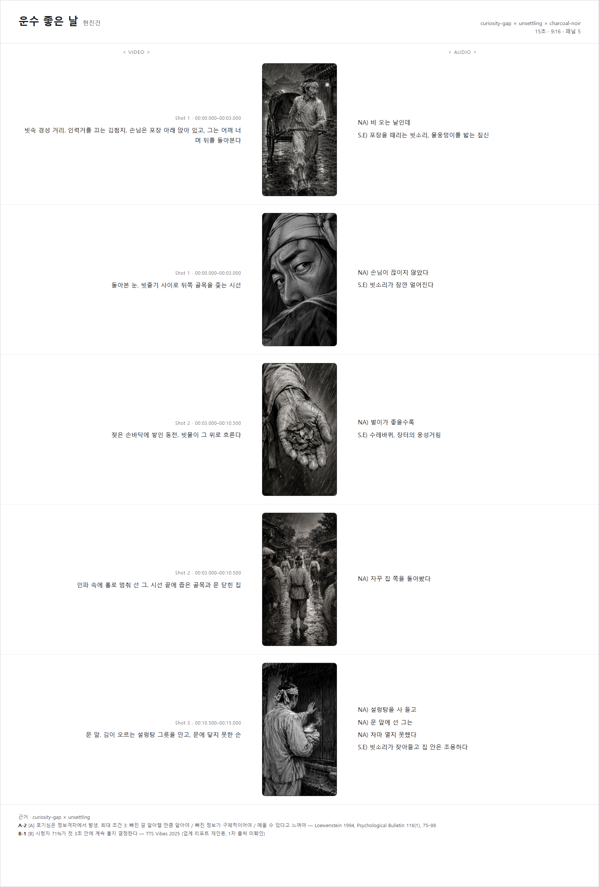

# book-shorts-storyboard

도서 소개 **15초 쇼츠** 한 편을 기획부터 자막까지 만들어 주는 [Agent Skill](https://agentskills.io).

책 정보를 넣으면 **근거가 붙은 컨셉 3안**을 받고, 하나를 고르면 스토리보드·영상 프롬프트·콘티 시트·자막·번인 스크립트가 한 번에 나온다. 영상 생성(MiniMax H3 등)과 업로드만 사람이 한다.

**특정 AI 서비스에 묶이지 않는다.** [Agent Skills 개방 표준](https://agentskills.io/specification)을 따르므로 Claude Code, Codex, Gemini CLI, GitHub Copilot, Cursor, VS Code, OpenCode 등 40여 개 클라이언트에서 동일하게 동작한다. 엔진은 순수 Node.js(외부 패키지 0)라 **에이전트 없이 터미널에서도 그대로 돈다.**

<p align="center">
  
</p>

<p align="center"><sub>스킬이 생성한 콘티 시트 — 현진건 「운수 좋은 날」</sub></p>

## 설계 원칙

**모델은 `storyboard.json` 하나만 쓴다.** 나머지는 전부 스크립트가 결정론적으로 파생한다.

영상 모델 문법, 자막 좌표, ffmpeg 인자, 패널 프롬프트의 반복 구절은 사람이(모델이) 매번 손으로 쓰면 조용히 틀어진다. 창작(훅·컷·대본·장면 묘사)만 모델이 하고, 문법과 좌표와 조립과 검증은 기계가 한다.

같은 이유로 **한글은 이미지 모델에 맡기지 않는다.** 자막은 ASS로 번인하고, 콘티 시트의 한글은 HTML로 조판한다.

## 왜 15초인가, 그리고 왜 근거인가

일반적인 쇼츠 권장 길이는 20~30초다. 15초는 그보다 짧아서 **줄거리를 요약할 여유가 없다.** 그래서 이 스킬은 요약 대신 **훅 하나만** 판다. 15초 안에 "무슨 책인지"가 아니라 "왜 열어봐야 하는지"만 남기면 성공이다.

컨셉 3안에는 근거 ID가 반드시 붙는다. 근거는 등급으로 나뉜다.

| 등급 | 뜻 | 예 |
|---|---|---|
| **A** | 동료심사 학술 | 정보격차 이론(Loewenstein 1994), 고각성 감정과 확산(Berger & Milkman 2012), 서사 몰입(Green & Brock 2000) |
| **B** | 대규모 산업 데이터 (1차 출처 미확인) | 첫 3초에 71%가 이탈 여부 결정, 3초 유지율 85%↑면 조회수 2.8배 |
| **C** | 업계 주장 (검증 불가) | 트로프 명시 시 인게이지먼트 3배 |

학술 근거와 마케팅 블로그 주장을 같은 무게로 쓰면 그게 더 나쁜 근거가 되므로 등급을 표시한다. 3안은 **서로 다른 주근거**에 기대야 한다. 같은 근거로 3개를 만들면 3안이 아니라 1안의 변주라서 고를 의미가 없다. 이 규칙은 검증기가 기계로 막는다.

## 요구사항

**필수는 Node.js 20+ 하나뿐이다.** 외부 패키지를 쓰지 않고 내장 모듈만 쓴다.

| | 용도 | 없으면 |
|---|---|---|
| **Node.js 20+** (24 권장) | 빌드 스크립트 | 동작 안 함 |
| 에이전트 (아무거나) | 컨셉 3안 제시와 `storyboard.json` 작성 | `storyboard.json`을 손으로 써도 된다 |
| 영상 모델 접근 | MiniMax H3(Hailuo) 등 | 프롬프트만 나오고 영상은 안 만들어진다 |
| **ffmpeg** | 자막 번인 | `subtitles.ass`를 편집기에서 직접 입힌다 |
| 이미지 생성 CLI | 콘티 패널 | 시트에 프롬프트 카드가 들어간다. `panel-prompts.txt`로 손수 뽑으면 된다 |
| Chromium 계열 브라우저 | 콘티 시트 PNG 캡처 | `contisheet.html`만 남는다. 브라우저로 열면 된다 |

아래 넷은 없어도 **빌드가 성공한다.** 경고만 남고 exit 0이다.

## 설치

### 에이전트에 스킬로 설치

`.agents/skills/`가 **여러 에이전트가 함께 읽는 벤더 중립 경로**다. 여기 두는 걸 권한다.

```bash
git clone https://github.com/blackstarzck/book-shorts-storyboard-skill.git ~/.agents/skills/book-shorts-storyboard
```

특정 클라이언트만 쓴다면 그쪽 경로에 둬도 된다.

| 클라이언트 | 개인 | 프로젝트 |
|---|---|---|
| **벤더 중립** (Codex 기본, Copilot·Gemini도 읽음) | `~/.agents/skills/` | `.agents/skills/` |
| Claude Code | `~/.claude/skills/` | `.claude/skills/` |
| Gemini CLI | `~/.gemini/skills/` | `.gemini/skills/` |
| GitHub Copilot | `~/.copilot/skills/` | `.github/skills/` |

프로젝트 스킬로 두면 레포에 같이 버전 관리된다. Windows PowerShell이면 `~` 대신 `$HOME`.

> **폴더 이름을 바꾸지 말 것.** 스펙상 `name` 필드와 부모 디렉터리 이름이 같아야 한다.
> 저장소 이름이 `-skill`로 끝나므로 위 명령처럼 **대상 경로를 반드시 지정**한다.

설치 후 에이전트를 새로 시작하면 `book-shorts-storyboard`로 잡힌다. 실행 중인 세션에는 반영되지 않는다.

### 에이전트 없이 — 그냥 CLI로

스킬로 설치하지 않아도 된다. 클론해서 `storyboard.json`을 쓰고 빌드하면 끝이다.

```bash
git clone https://github.com/blackstarzck/book-shorts-storyboard-skill.git
cd book-shorts-storyboard-skill

mkdir -p out && cp scripts/fixtures/kafka-metamorphosis.json out/storyboard.json
node scripts/build-storyboard.mjs out --no-png
```

`scripts/fixtures/kafka-metamorphosis.json`이 스키마 정본이다. 이걸 복사해 고치면 된다.
검증에 걸리면 어떤 규칙이 왜 깨졌는지 알려준다.

### 설치 확인

```bash
node --test "scripts/**/*.test.mjs"
```

74개가 전부 통과하면 정상이다.

## 사용법

에이전트에서 스킬을 부르고 책 정보를 준다. 제목·저자·줄거리면 충분하고, 인용구가 있으면 더 좋다.

호출 방법은 클라이언트마다 다르다. 슬래시 명령을 쓰는 곳도 있고(`/book-shorts-storyboard`), 설명이 맞으면 알아서 활성화되는 곳도 있다. 어느 쪽이든 이름을 언급하면 잡힌다.

```
book-shorts-storyboard 스킬로 만들어줘.

변신 / 프란츠 카프카
어느 날 아침 그레고르 잠자는 불안한 꿈에서 깨어나 자신이 거대한 벌레로
변해 있는 것을 발견한다. 가족은 그를 방에 가두고, 세상은 아무 일 없다는 듯 흘러간다.
```

그러면 이렇게 진행된다.

1. 훅 재료를 뽑는다 — 트로프, 반전 전제, 감정 정점, 첫 장면의 시각적 이상
2. **컨셉 3안을 근거와 함께 제시한다** (훅 유형 × 톤 × 비주얼)
3. 고르면 `storyboard.json`을 쓴다
4. 빌드해서 검증을 통과시킨다
5. 콘티 패널을 생성한다 (선택, 수 분 소요)

빌드는 직접 돌려도 된다.

```bash
node "<스킬 폴더>/scripts/build-storyboard.mjs" <출력 폴더> --no-png
node "<스킬 폴더>/scripts/build-storyboard.mjs" <출력 폴더> --panels
```

| 플래그 | 뜻 |
|---|---|
| `--no-png` | 콘티 시트 PNG 캡처를 건너뛴다. 빠른 반복용 |
| `--panels` | 콘티 패널 이미지를 생성한다 (패널당 1~2분) |
| `--force-panels` | 이미 있는 패널도 다시 만든다 |
| `--panel-cmd <명령>` | 패널을 만들 CLI를 지정한다. 아래 참조 |

검증에 실패하면 exit 1로 멈추고 어떤 규칙이 왜 깨졌는지 알려준다. 이때 산출물은 만들지 않는다. 반쪽짜리를 남기지 않기 위해서다.

### 콘티 패널 백엔드

패널 생성에 필요한 조건은 하나다. **지시문 파일을 읽고 이미지를 만들어 지정한 경로에 저장할 수 있는 CLI.** 어느 서비스든 상관없다.

| 순위 | 방법 |
|---|---|
| 1 | `--panel-cmd "<명령> {prompt}"` |
| 2 | 환경변수 `BOOK_SHORTS_PANEL_CMD` |
| 3 | 스킬 폴더의 `panel-backend.json` — `{"command": "<명령> {prompt}"}` |
| 4 | 기본 프리셋 `codex` |

`{prompt}` 자리에 지시문이 인용돼 들어간다. 자리표시자가 없으면 끝에 붙는다.

내장 프리셋은 `codex` 하나뿐이다. **실제로 확인한 것만 싣는다** — 검증하지 않은 CLI의 플래그를 넣으면 쓰는 사람은 그게 검증된 줄 안다. 다른 도구는 위 방법으로 붙인다.

**백엔드가 아예 없어도 된다.** `panel-prompts.txt`에 패널별 프롬프트가 파일 경로와 함께 그대로 있다. 아무 이미지 도구에 붙여넣고 결과를 `panels/panel-NN.png`로 저장한 뒤 `--panels` 없이 다시 빌드하면 시트가 채워진다. 이 경로가 가장 이식성이 높다.

## 산출물

출력 폴더에 이렇게 생긴다.

| 파일 | 작성자 | 용도 |
|---|---|---|
| `storyboard.json` | **모델** | 유일한 원본. 고칠 것은 이것뿐이다 |
| `storyboard.md` | 스크립트 | 사람이 읽는 기획서 — 컨셉·근거·타임라인·자막·제작 절차 |
| `h3-prompt.txt` | 스크립트 | 영상 모델에 붙여넣을 프롬프트 |
| `panel-prompts.txt` | 스크립트 | 콘티 패널 프롬프트. 어느 이미지 도구에든 이식된다 |
| `panels/panel-NN.png` | Codex | 콘티 그림. 영상 모델 레퍼런스로도 재투입된다 |
| `contisheet.html` / `.png` | 스크립트 | 콘티 시트 (VIDEO │ 패널 │ AUDIO) |
| `subtitles.ass` | 스크립트 | 자막 (UTF-8 BOM) |
| `burn.ps1` | 스크립트 | ffmpeg 번인 스크립트 |
| `build-report.json` | 스크립트 | 검증 결과와 지표 |

`storyboard.json` 외에는 전부 파생물이다. 직접 고치지 말고 JSON을 고쳐 다시 빌드한다.

## 검증 규칙

| ID | 내용 |
|---|---|
| V1 | 샷 2~3개, 0부터 빈틈 없이 연속, 마지막이 duration(4~15 정수)과 일치 |
| V2 | 내레이션 **한글 75음절 이하** — 5.5음절/초 × 15초에서 호흡 여유를 뺀 값 |
| V3 | 자막 큐 최대 2줄 × 12자, 0.8초 이상, 겹침 없음 |
| V4 | 조립된 프롬프트 7,000자 이하 |
| V5 | 컨셉 3개, 근거 ID 실재, **주근거·훅 유형 중복 없음** |
| V6 | 샷당 카메라 1개, 정해진 18개 타입 중 하나 |
| V7 | 패널 4~6개, 샷 참조 유효, `style_lock` 존재 |
| V8 | 제목 카드가 마지막 샷 구간 안 |
| V9 | 제목과 슬러그 |

V2가 가장 자주 걸린다. **"15초 안에 줄거리 설명"이 실패하는 지점은 거의 항상 대본이 길어서**고, 눈으로는 안 잡힌다.

## 다른 앱에 맞추기 — 납품 프로파일

자막 좌표는 코드에 박혀 있지 않다. **납품 프로파일**로 빠져 있어서 앱마다 갈아끼운다.

| 내장 프로파일 | 캔버스 | 자막 | 줄당 | 크롭 |
|---|---|---|---|---|
| `generic-9x16` (기본) | 1080×1920 | Noto Sans KR 54px, 마진 130/384 | 15자 | 없음 |
| `ttokttok` | 1440×2560 | Malgun Gothic 72px, 마진 288/384 | 12자 | 좌우 6% |

고르는 방법은 셋이다. 우선순위대로다.

```bash
# 1. CLI — 내장 이름 또는 JSON 파일 경로
node scripts/build-storyboard.mjs out --profile ttokttok
node scripts/build-storyboard.mjs out --profile ./my-app.json
```

```jsonc
// 2. storyboard.json 의 delivery 필드 — 재빌드가 재현되므로 이쪽을 권한다
{ "duration_sec": 15, "delivery": "ttokttok", ... }

// 내장 프로파일 위에 일부만 덮어쓸 수도 있다
{ "delivery": { "base": "ttokttok", "subtitle": { "font": "Pretendard" } } }
```

3\. 아무것도 없으면 `generic-9x16`.

### 유도되는 값

좌표만 설정으로 빼면 반쪽이다. 아래 셋은 **프로파일에서 계산되므로** 값을 바꾸면 자동으로 따라온다.

| 값 | 계산 | 쓰이는 곳 |
|---|---|---|
| 줄당 글자수 | `(캔버스 폭 - 좌우 마진×2) ÷ 자막 크기` | 자막 줄바꿈, 검증 V3 |
| 구도 세이프 % | `(1 - 크롭×2) × 100` | 영상 프롬프트의 "중앙 N% 안에" 지시 |
| ASS 색 | hex → `&HAABBGGRR` | 자막 스타일 |
| CSS 폰트 스택 | 자막 폰트 + 제목 폰트 + 폴백 | 콘티 시트 HTML |
| ffmpeg 필터 | `ass=subtitles.ass[:fontsdir=…]` | 번인 스크립트 |
| ASS 정렬 | 이름 → 숫자패드 1~9 | 자막 스타일 |

크롭이 `0`이면 구도 지시 문장 자체가 빠진다. "중앙 100%"는 무의미하기 때문이다.

### 위치

자막과 제목 카드를 프레임 어디로든 옮긴다.

```json
{
  "base": "ttokttok",
  "subtitle":  { "align": "top-center",    "marginX": 288, "marginV": 256 },
  "titleCard": { "align": "bottom-center", "marginV": 700 }
}
```

| 항목 | 뜻 |
|---|---|
| `align` | 기준점. `bottom-left` `bottom-center` `bottom-right` `middle-left` `middle-center` `middle-right` `top-left` `top-center` `top-right`. ASS 숫자(1~9)도 받는다 |
| `marginX` | 좌우 여백. 줄당 글자수가 여기서 유도된다 |
| `marginV` | **정렬된 기준 변에서의 거리.** 하단 정렬이면 아래에서, 상단 정렬이면 위에서. 중앙 정렬에서는 무시된다 |

정렬을 이름으로 쓰는 이유는 ASS의 숫자패드 배치를 외우게 하지 않기 위해서다. `8`을 상단이라고 착각해 `5`(정중앙)를 쓰는 실수가 흔하다. **알 수 없는 값은 빌드를 멈춘다** — 조용히 하단 중앙으로 떨어지면 결과를 볼 때까지 모른다.

> `marginBottom`은 `marginV`로 이름이 바뀌었다. 정렬을 열면서 "하단"이라는 이름이 거짓이 됐기 때문이다. 예전 이름도 별칭으로 계속 받는다.

### 폰트

폰트를 바꾸면 **자막·콘티 시트·번인 명령이 한꺼번에** 따라온다.

```json
{
  "base": "ttokttok",
  "subtitle":  { "font": "Pretendard" },
  "titleCard": { "font": "Black Han Sans" },
  "fonts": { "webStack": ["Noto Sans KR", "sans-serif"], "dir": "C:/Users/me/fonts" }
}
```

| 항목 | 뜻 |
|---|---|
| `subtitle.font` | 자막 폰트. ASS `Style: Sub` 에 들어간다 |
| `titleCard.font` | 제목 카드 폰트. 생략하면 자막 폰트를 따른다 |
| `fonts.webStack` | 콘티 시트(HTML)의 폴백. 자막·제목 폰트가 자동으로 앞에 붙는다 |
| `fonts.dir` | 시스템에 안 깔린 폰트를 쓸 때. ffmpeg `fontsdir=` 로 들어가며 경로의 콜론은 자동 이스케이프 |

**libass는 폰트를 못 찾으면 경고 없이 다른 폰트로 그린다.** 결과 영상을 보기 전엔 모른다. 그래서 `burn.ps1` 머리에 기대하는 폰트 이름을 적어두고, 실행이 끝나면 확인하라고 알린다. 시스템에 없는 폰트라면 `fonts.dir`를 지정한다.

### 색

색은 **일반 hex로 쓴다.** ASS 원형은 `&HAABBGGRR`로 채널이 BGR 역순이고 알파가 뒤집혀 있어서(`00`이 불투명) 손으로 쓰면 빨강과 파랑이 바뀐다. 변환은 스킬이 한다.

```json
{
  "base": "ttokttok",
  "subtitle":  { "color": "#FFFFFF", "outlineColor": "#000000", "shadowColor": "#00000080", "shadow": 0 },
  "titleCard": { "color": "#FFD400" }
}
```

- `#RRGGBB` 또는 `#RRGGBBAA`(CSS 관례대로 `FF`가 불투명). `&H…` 원형도 그대로 받는다
- `titleCard`의 색을 생략하면 자막 색을 따른다
- `shadow`가 `0`이면 그림자를 그리지 않으므로 `shadowColor`는 쓰이지 않는다
- 알 수 없는 형식은 **빌드를 멈춘다.** 조용히 검정으로 떨어지지 않는다

**명암비가 4.5:1 아래면 경고한다.** 막지는 않는다. 영상 위 자막은 배경을 고를 수 없어서 외곽선이 글자를 분리하는 유일한 수단이고, 그래서 흰 글자에 검정 외곽선이 사실상의 표준이다. 다른 조합을 쓰려면 쓰되, 그게 어떤 상태인지는 알고 쓰는 게 좋다.

```
(경고 PROFILE) 자막 명암비 2.3:1 — 권장 4.5:1 이상. 영상 위 자막은 배경을 고를 수 없어
외곽선이 유일한 분리 수단이다 (글자 #FFFFFF / 외곽선 #AAAAAA).
```

### 새 프로파일 만들기

JSON 한 장이면 된다. `base`를 지정하면 그 위에 병합된다.

```json
{
  "base": "generic-9x16",
  "canvas": { "width": 1440, "height": 2560 },
  "subtitle": { "font": "Pretendard", "size": 64, "marginX": 200, "marginBottom": 420,
                "color": "#FFFFFF", "outlineColor": "#101010" },
  "framing": { "cropPerSide": 0.04 }
}
```

**세로 영상이 세로로 더 긴 컨테이너에서 `object-cover`로 표시되면 좌우가 잘린다.** 그런 플레이어에 납품한다면 `cropPerSide`를 실측해 넣어야 인물 얼굴이 안 잘린다. 산출 방법은 `references/ttokttok-delivery.md`에 실측 사례로 정리돼 있다.

## 알려진 한계

**자막과 음성이 어긋날 수 있다.** MiniMax H3는 샷별 대사를 한 덩어리로 받아 **스스로 속도를 정해** 읽는데, 자막은 우리가 계획한 타임코드로 번인된다. 일치한다는 보장이 없다. 영상을 받아 어긋난 정도를 재고 `narration[].start/end`를 맞춘 뒤 다시 빌드하면 된다.

**한국어 TTS 품질은 미검증이다.** H3가 한국어를 공식 지원한다는 것만 확인했다.

**프리셋 문구를 고치면 룩이 바뀐다.** `ink-line-art`에서 배경 한 구절만 바꿨더니 얇은 선화가 아니라 짙은 목탄화가 나왔다. 프롬프트는 여전히 "thin clean strokes"라고 말하고 있었다. 프리셋을 손봤다면 전량 생성 전에 **한 장만 뽑아 확인**한다.

**음절 5.5/초는 뉴스 낭독 기준 근사치다.** 실제 영상에서 재보고 조정할 값이다.

## 예제

| 예제 | 컨셉 | 특징 |
|---|---|---|
| [`examples/kafka-metamorphosis/`](examples/kafka-metamorphosis/) | curiosity-gap × unsettling × ink-line-art | 스키마 정본. 얇은 선화 |
| [`examples/hyeonjingeon-lucky-day/`](examples/hyeonjingeon-lucky-day/) | curiosity-gap × unsettling × charcoal-noir | 실제 도서 데이터. 목탄 톤 |

패널 원본(`panels/*.png`)은 용량 때문에 제외했다. `--panels`로 다시 생성할 수 있다.

## 참조 문서

| 문서 | 내용 |
|---|---|
| `SKILL.md` | 워크플로와 제약 |
| `references/hook-playbook.md` | 훅 유형 8종, 톤 6종, 비주얼 프리셋 7종, 증거 요약과 충돌 해소 |
| `references/evidence.json` | 근거 ID 정본 — 등급·주장·출처 |
| `references/h3-prompt-spec.md` | MiniMax H3 문법 |
| `references/conti-panel-spec.md` | 패널 프롬프트 조립과 Codex 호출 |
| `references/ttokttok-delivery.md` | 세이프영역 실측, ASS 스타일, 납품 절차 |
